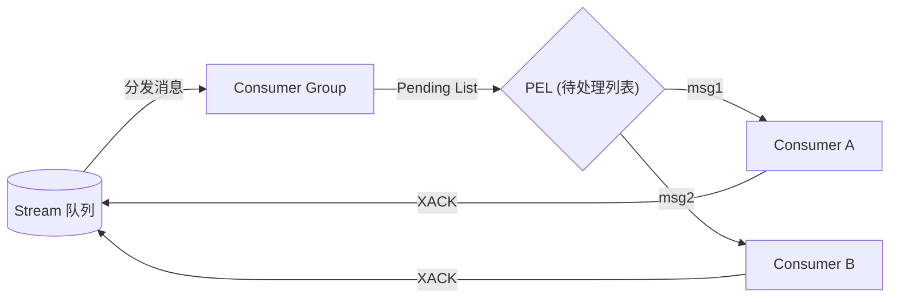
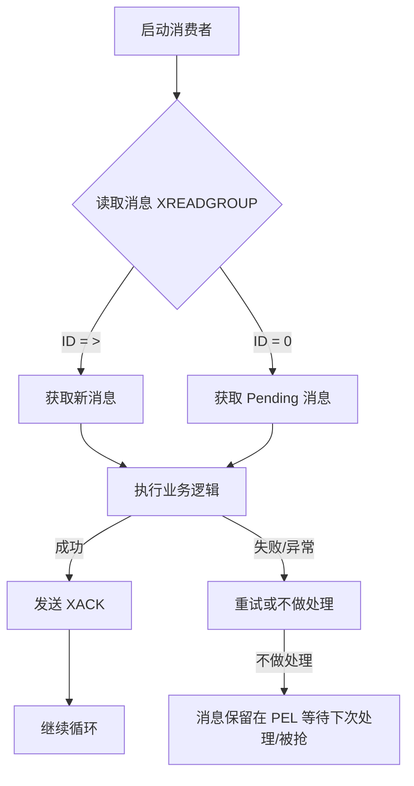

# Redis Stream 消费者组模式 (Consumer Group) 学习笔记

## 1. 为什么需要消费者组？
- **竞争消费 (Load Balancing)**：
  - 多个消费者（Consumer）组成一个组（Group），共同消费一个队列（Stream）。
  - **消息分流**：一条消息只会被组内的一个消费者抢到，实现负载均衡，加快处理速度。
- **消息确认 (Reliability)**：
  - 引入了 **ACK 机制** 和 **Pending List**，确保消息即便在处理过程中系统宕机也不会丢失。

## 2. 核心概念结构



- **Group (组)**：维护整个组的消费进度 (`last_delivered_id`)。
- **Consumer (消费者)**：组内的成员，竞争获取消息。
- **Pending List (PEL)**：
    - 全称：Pending Entries List。
    - 存储：**已领取但未 ACK** 的消息。
    - 作用：保证消息可靠性。如果消费者挂了，消息依然在 PEL 里，不会丢失。

## 3. 关键命令详解

### 3.1 创建组：`XGROUP CREATE`
```bash
XGROUP CREATE key groupname ID [MKSTREAM]
```
- `ID`: 
    - `0`：从队列第一条消息开始消费（包含历史数据）。
    - `$`：只消费创建组之后产生的新消息。
- `MKSTREAM`: 如果队列不存在，自动创建。

### 3.2 组内读取：`XREADGROUP`
```bash
XREADGROUP GROUP group consumer [BLOCK ms] STREAMS key ID
```
- **ID 参数是核心**：
    - **`>` (大于号)**：**读取从未分发给任何人的新消息**。Redis 会更新组的读取进度。
    - **`0` (或其他具体 ID)**：**读取 PEL (自己的待办列表) 中的消息**。通常用于故障恢复（重启后检查自己死前没做完的任务）。
- **隔离性**：当使用 `0` 读取 PEL 时，**只能**读到属于**本消费者**的消息。

### 3.3 确认消息：`XACK`
```bash
XACK key group ID [ID ...]
```
- **作用**：告诉 Redis “这条消息我处理完了”。
- **结果**：将消息从 PEL 中移除。**不删除** Stream 里的原始消息。

### 3.4 故障恢复（挖墙脚）：`XCLAIM`
```bash
XCLAIM key group new_consumer min-idle-time ID
```
- **场景**：Consumer A 领了任务如果不干活（宕机/卡死），消息会在 PEL 里待很久（Idle Time 变长）。
- **作用**：Consumer B 发现这条消息闲置（Idle）超过了指定时间（如 60s），把它**抢过来**（变更 Owner 为自己）并在后续处理完后 ACK。

## 4. 标准消费逻辑流程


